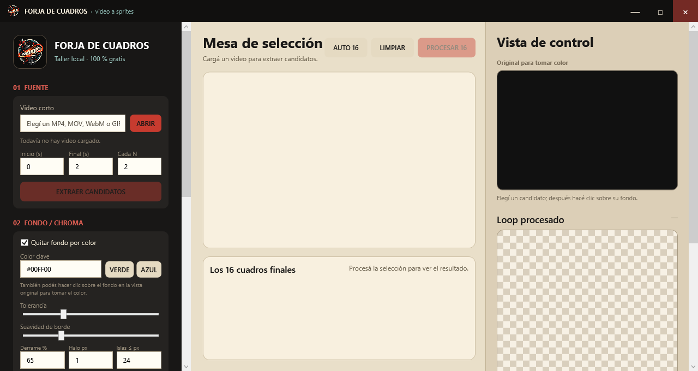

# Forja de Cuadros

Aplicación gratuita y local para convertir un video corto en una animación raster de 16 cuadros lista para revisar e integrar en Godot.



La herramienta prepara imágenes transparentes sobre chroma, recibe MP4, MOV, WebM o GIF, extrae fotogramas con FFmpeg y permite seleccionar, limpiar, alinear, auditar y exportar la animación. El procesamiento tradicional es local; el asistente Kaggle I2V es opcional y sólo envía la imagen cuando el usuario inicia la generación.

> **English:** A free, local Windows tool that turns a short video into a reviewed 16-frame raster animation package for Godot. The UI is currently in Spanish.

## Qué resuelve

- Extrae candidatos de un tramo preciso del video.
- Distribuye automáticamente una selección inicial de 16 cuadros.
- Quita fondos verdes o azules con tolerancia, suavizado, despill, erosión de halo, limpieza de islas y corte alfa ajustable.
- Mantiene una escala común y registra raíz/suelo según el tipo de movimiento.
- Detecta cuadros vacíos, duplicados, recortes, deriva de altura/suelo/raíz y una mala costura del loop.
- Exporta PNG individuales, atlas 4×4 u horizontal, GIF, revisión HTML, metadata JSON y `SpriteFrames.tres`.
- Conserva cada exportación en una carpeta nueva: no pisa animaciones previas.
- Convierte localmente la transparencia de una imagen en fondo verde o azul, muestra lado a lado el original y el chroma preparado, y la entrega preseleccionada al asistente I2V.
- Incluye un asistente Kaggle I2V para convertir una imagen en MP4 mediante un trabajo privado con GPU T4 y cargar el resultado directamente en la mesa de selección.

## Requisitos

- Windows 10 u 11, x64.
- [.NET 8 SDK](https://dotnet.microsoft.com/download/dotnet/8.0) para compilar. Una publicación dependiente del framework requiere además el .NET 8 Desktop Runtime.
- [FFmpeg](https://ffmpeg.org/) y `ffprobe` disponibles en `PATH`. En Windows también se detecta la instalación de WinGet:

```powershell
winget install --id Gyan.FFmpeg --exact
```

## Inicio rápido

```powershell
git clone https://github.com/ldebortoli/forja-de-cuadros.git
cd forja-de-cuadros
dotnet build ForjaDeCuadros.sln -c Release
dotnet run --project src\ForjaDeCuadros\ForjaDeCuadros.csproj -c Release
```

Para instalarla en el menú Inicio con su icono propio:

```powershell
powershell -NoProfile -ExecutionPolicy Bypass -File src\ForjaDeCuadros\install_forja.ps1
```

Usá `-SelfContained` para incluir el runtime de .NET en la instalación, o `-CodexApps` si querés instalarla en tu carpeta personal `Codex Apps`.

## Workflow recomendado

1. Generá el personaje donde prefieras y, si es posible, guardalo como PNG transparente.
2. En `00 GENERAR IMAGEN`, elegí el archivo: Forja prepara chroma verde automáticamente y completa la ruta del paso 01. Podés cambiarla a azul con un clic. Este paso es local y no consume créditos.
3. En `01 CONVERTIR A VIDEO`, abrí Kaggle I2V —o usá cualquier otra herramienta— y pedí cámara fija, personaje completo y una sola acción de 2–4 segundos.
4. En `02 VIDEO`, cargá el clip, definí inicio/final y extraé candidatos.
5. Elegí exactamente 16 cuadros; `AUTO 16` distribuye la selección sobre todo el tramo.
6. En `03 FONDO / CHROMA`, tomá el color del fondo. Si queda un contorno semitransparente, dejá activa `Limpiar halo con corte alfa`, subí **Corte alfa** hasta eliminarlo y compensá un borde dentado con un poco de **Suavizado del corte**. La vista sobre damero se actualiza mientras movés ambos controles.
7. Elegí el registro:
   - **Suelo + raíz fijos:** loops in-place.
   - **Suelo fijo, conservar avance:** locomoción a través del canvas.
   - **Cámara fija:** saltos, caídas o dash con movimiento vertical.
8. Procesá y revisá el GIF, los bordes, las huellas únicas y la costura `16 → 01`.
9. Exportá el paquete e integrá el atlas aprobado a la ruta declarada para Godot.

El corte alfa viene activo en `10 %` con `4 %` de suavizado. Forja lo aplica antes de calcular los límites y de nuevo después del escalado: la primera pasada evita que el halo altere la alineación y la segunda elimina transparencias débiles introducidas por el remuestreo. Los PNG originales nunca se modifican.

### Generar el clip desde la propia aplicación

El botón `ABRIR KAGGLE I2V` del paso **01 CONVERTIR A VIDEO** abre el asistente integrado y recibe automáticamente la imagen elegida o preparada en el paso 00. Antes de OAuth muestra una guía de alta, correo y verificación de cuenta, exige confirmar que esos pasos terminaron y avisa si se intenta conectar antes de tiempo. Después prepara o actualiza Kaggle CLI 2.2.2 en un entorno aislado, conecta la cuenta mediante OAuth en el navegador y detecta automáticamente el usuario autenticado. `VERIFICAR` muestra un resultado persistente de éxito o fallo, y el mismo panel consulta el porcentaje y las horas de cuota GPU semanal restante. Al generar, sube la imagen con licencia temporal `other` como dataset privado, ejecuta LTX-Video 2B con descarga secuencial CPU/GPU en una T4, espera el resultado y recupera el MP4. Si el kernel falla, Forja descarga su log y explica causas conocidas. Forja nunca pide la contraseña ni escribe tokens dentro del proyecto.

La cuenta debe tener correo y teléfono verificados para acceder a GPU. La disponibilidad es compartida, puede haber cola y la cuota semanal varía. Consultá el [instructivo completo de Kaggle](docs/kaggle.md).

> **Calidad:** que el kernel termine no garantiza fidelidad visual. LTX-Video 2B puede alterar cara, manos, anatomía, ropa/equipo y uniformidad del chroma; revisá el MP4 antes de convertirlo en cuadros y no uses este modo para personajes cuya identidad deba preservarse estrictamente.

La auditoría automática encuentra problemas mecánicos, pero no reemplaza la revisión de anatomía, dirección de pies, ropa, pelo o equipo rígido.

## Desarrollo, tests y cobertura

Suite rápida y determinista:

```powershell
dotnet test ForjaDeCuadros.sln -c Release --no-restore
```

Cobertura con umbrales de regresión para el núcleo de procesamiento (líneas 78 %, ramas 48 % y métodos 72 %):

```powershell
dotnet test tests\ForjaDeCuadros.Tests\ForjaDeCuadros.Tests.csproj -c Release --no-restore /p:CollectCoverage=true
```

Autoprueba completa con FFmpeg (más lenta):

```powershell
dotnet build src\ForjaDeCuadros\ForjaDeCuadros.csproj -c Release
$report = Join-Path $PWD 'artifacts\self-test.json'
$process = Start-Process -FilePath 'src\ForjaDeCuadros\bin\Release\net8.0-windows\ForjaDeCuadros.exe' -ArgumentList @('--self-test', $report) -WindowStyle Hidden -Wait -PassThru
exit $process.ExitCode
```

Captura reproducible del panel de limpieza alfa:

```powershell
$capture = Join-Path $PWD 'artifacts\alpha-controls.png'
$process = Start-Process -FilePath 'src\ForjaDeCuadros\bin\Release\net8.0-windows\ForjaDeCuadros.exe' -ArgumentList @('--capture-alpha', $capture, '--capture-width', '1440', '--capture-height', '960') -WindowStyle Hidden -Wait -PassThru
exit $process.ExitCode
```

CI ejecuta build, tests y cobertura en cada push y pull request. La autoprueba con FFmpeg queda como workflow manual para cuidar los minutos gratuitos.

Coverlet mide líneas, ramas y métodos; no expone una métrica de *statements* separada, por lo que líneas es el control equivalente para sentencias ejecutables. La medición local actual es 85,57 % de líneas, 51,40 % de ramas y 77,35 % de métodos.

## Privacidad y alcance

- La preparación de transparencia/chroma, la selección de cuadros y la exportación ocurren enteramente en tu PC.
- El flujo local no requiere cuentas, telemetría, API keys ni servicios en la nube.
- El procesamiento tradicional sigue siendo enteramente local. `KAGGLE I2V` es opcional y sí envía la imagen y el prompt a Kaggle cuando el usuario pulsa `SINCRONIZAR Y GENERAR`.
- Los trabajos Kaggle creados por Forja son privados. La limpieza remota posterior a la descarga está activada por defecto.
- Los logs de fallos, si existen, quedan en `%LOCALAPPDATA%\ForjaDeCuadros\Logs`.
- Los binarios, videos, exportaciones, logs y contenido del usuario están excluidos del repositorio.

## Licencia

[MIT](LICENSE). Podés usar, modificar y compartir la herramienta, incluso en proyectos comerciales.
